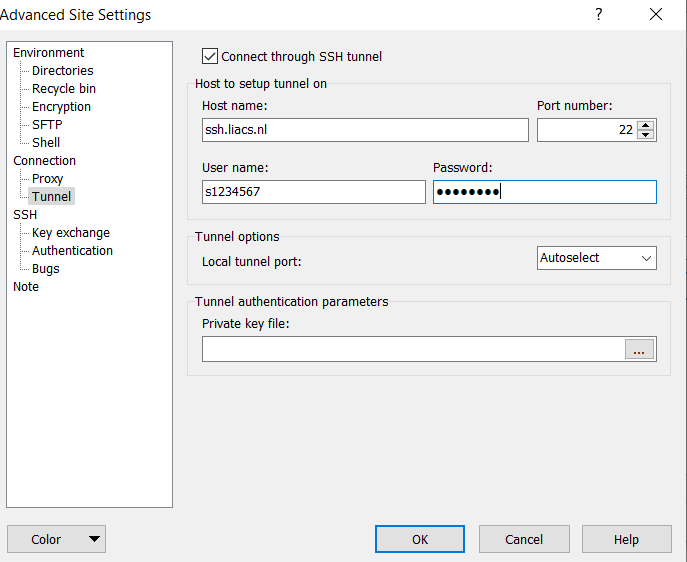
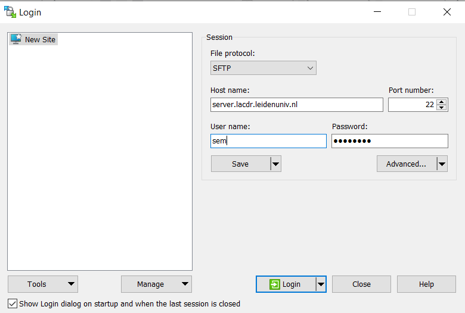

# Account Information

## Advanced settings tunnel 

- after download of WinSCP: https://winscp.net/eng/download.php
- Go to Advanced Settings and select Connection -> Tunnel
- check the box for 'Connect through SSH tunnel'

**Username:** studentnumber  
**Password:** ULCN account password / brightspace

# Server Details

## SFTP Configuration

- login as shown below

- **Protocol:** SFTP
- **Port:** 22

## Server Information

- **Hostname:** server; tiberius, nerva, etc.
- **Username (Server):** server username
- **Password (Server):** password to server
